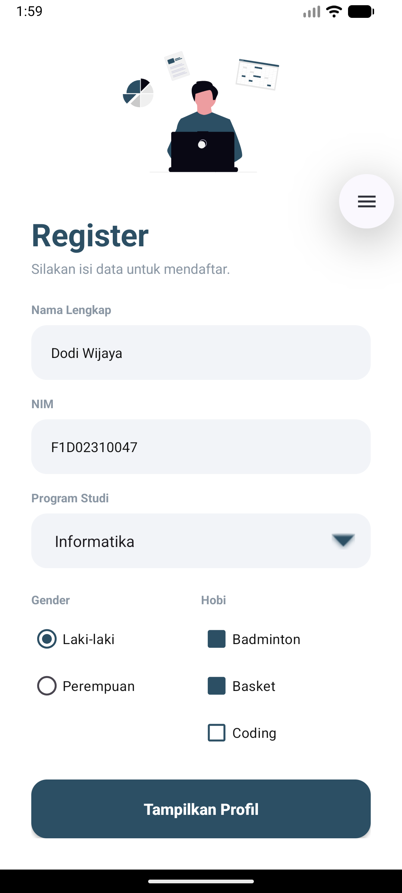
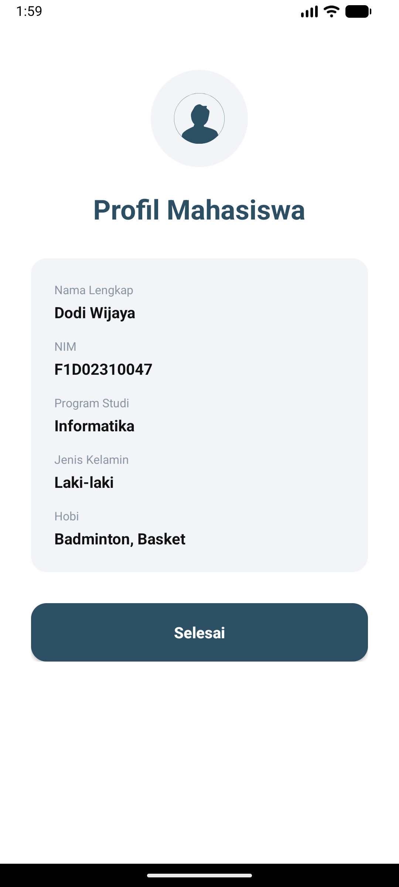

# Tugas 3 Pemrograman Bergerak - Aplikasi Registrasi Mahasiswa

Aplikasi Android sederhana berbasis Kotlin yang mendemonstrasikan penggunaan **Activities**, **Explicit Intents**, pengiriman data menggunakan **Parcelable**, dan desain antarmuka (UI) modern berbasis XML.

## Fitur Aplikasi
- **Halaman Registrasi:** Form pengisian data mahasiswa yang dilengkapi dengan validasi input (menggunakan *EditText*, *Spinner*, *RadioGroup*, dan *CheckBox*).
- **Halaman Profil:** Menampilkan hasil input data dalam bentuk kartu profil yang rapi menggunakan *CardView*.
- **Data Transfer:** Mengirim data registrasi pengguna dari *Registration Screen* ke *Profile Screen* dengan efisien menggunakan antarmuka `Parcelable`.

## 📸 Screenshot Hasil Aplikasi

| Halaman Registrasi | Halaman Profil |
| :---: | :---: |
|  |  |

---
**Dibuat oleh:** Dodi Wijaya (F1D02310047)
